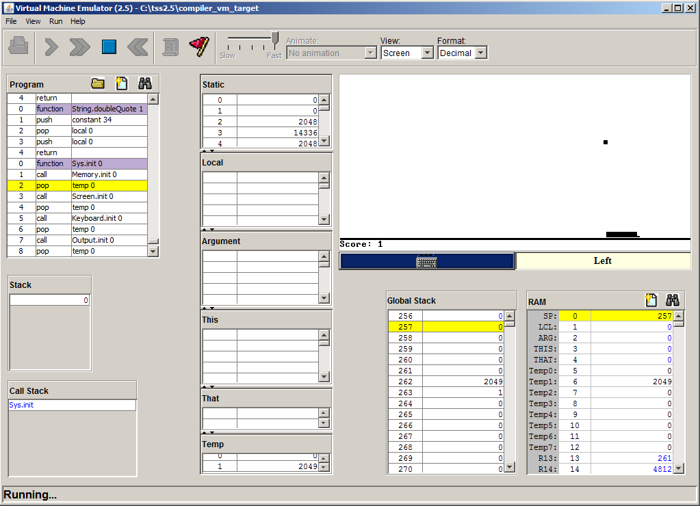

# nand2pong
This Jack compiler is one of the final projects for the book The Elements of Computing Systems by Noam Nisan and Shimon Shocken, aka Nand2Tetris, or in this case Nand2Pong. This program compiles .jack language files into .vm files for the Jack virtual machine. Additionally, it creates .xml files that show the parse tree.

More information: http://nand2tetris.org

#### Usage:
jackcompiler.exe [directory name or filename.jack]

#### Notes:
This was my first significant C project, so the code is not particulary elegant, but it shows I did the coursework. The program successfully creates .vm files that, when run in the Virtual Machine Emulator, allow the user to play a (slow) game of Pong. I did not write the VM Emulator; it's part of the software provided with The Elements of Computing Systems. Here is a screenshot of the VM Emulator running my compiled Jack code:

